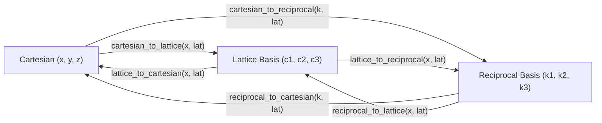
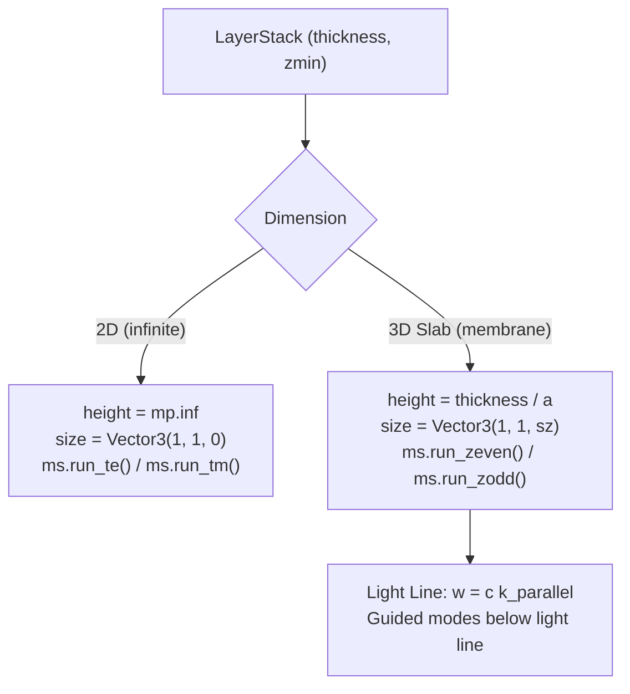

# MIT Photonic Bands (MPB) Architecture & Solver Guide

This document serves as the persistent reference and memory file for **MIT Photonic Bands (MPB)**: its underlying physics, Python API (`meep.mpb`), coordinate transformations, simulation setups, and band structure extraction.

---

## 1. Overview & Physics Formulation

MPB is an electromagnetic frequency-domain eigensolver designed to compute the band structures (dispersion relations $\omega(\mathbf{k})$) and electromagnetic field profiles of periodic dielectric structures.

### The Master Equation
From Maxwell's curl equations in a linear, non-magnetic ($\mu = 1$), time-harmonic medium ($\mathbf{H}(\mathbf{r}, t) = \mathbf{H}(\mathbf{r}) e^{-i\omega t}$), the magnetic field satisfies the Hermitian eigenvalue problem:

$$\mathbf{\nabla} \times \left( \frac{1}{\varepsilon(\mathbf{r})} \mathbf{\nabla} \times \mathbf{H}(\mathbf{r}) \right) = \left(\frac{\omega}{c}\right)^2 \mathbf{H}(\mathbf{r})$$

Subject to the transversality condition:
$$\mathbf{\nabla} \cdot \mathbf{H}(\mathbf{r}) = 0$$

### Bloch's Theorem & Reciprocal Space
Due to spatial periodicity $\varepsilon(\mathbf{r} + \mathbf{R}) = \varepsilon(\mathbf{r})$, eigenmodes take the Bloch form:
$$\mathbf{H}_{\mathbf{k}}(\mathbf{r}) = e^{i \mathbf{k} \cdot \mathbf{r}} \mathbf{u}_{\mathbf{k}}(\mathbf{r}), \quad \mathbf{u}_{\mathbf{k}}(\mathbf{r} + \mathbf{R}) = \mathbf{u}_{\mathbf{k}}(\mathbf{r})$$

MPB discretizes $\mathbf{u}_{\mathbf{k}}(\mathbf{r})$ on a uniform grid in the unit cell using a planewave basis and solves for the lowest $N$ eigenvalues $\omega_n(\mathbf{k})$ using a preconditioned conjugate-gradient minimization algorithm.

### Scale Invariance & Dimensionless Units
Maxwell's equations possess no intrinsic length scale. MPB operates entirely in **dimensionless units**:
* Lengths are normalized by the lattice constant $a$ (so $a \equiv 1$).
* Frequencies are reported as:
  $$\tilde{\omega} = \frac{\omega a}{2\pi c} = \frac{a}{\lambda}$$
* To convert an MPB frequency $\tilde{\omega}$ to physical wavelength $\lambda$ in microns:
  $$\lambda = \frac{a}{\tilde{\omega}}$$

---

## 2. Python API Conventions

Modern MPB is bundled with Meep:
```python
import meep as mp
from meep import mpb
```

### The Three Core Classes
1. **`mp.Lattice`**: Defines the periodic simulation cell, basis directions, and domain size.
2. **`mp.Medium`**: Defines material permittivity $\varepsilon$ (scalar, diagonal anisotropic `epsilon_diag`, or dispersive).
3. **`mp.GeometricObject`**: Shapes that form the dielectric structure (`mp.Prism`, `mp.Cylinder`, `mp.Block`, `mp.Sphere`).
   * *Rule of Precedence*: When objects overlap, **later objects in the `geometry` list overwrite earlier objects**.
   * Background: Set via `default_material = mp.Medium(...)`.

---

## 3. Lattice Definitions & The `size` Parameter

The simulation domain is configured using `geometry_lattice = mp.Lattice(...)`:

```python
lattice = mp.Lattice(
    basis1=mp.Vector3(1, 0, 0),
    basis2=mp.Vector3(0.5, 0.5 * np.sqrt(3), 0),
    basis3=mp.Vector3(0, 0, 1),
    basis_size=mp.Vector3(1, 1, 1),
    size=mp.Vector3(1, 1, 0),
)
```

### Key Parameters:
* **`basis1, basis2, basis3`** (`Vector3`): Unit directions of the lattice vectors in Cartesian space. Their lengths are ignored; their magnitudes are controlled by `basis_size`.
* **`basis_size`** (`Vector3`): Physical lengths of the basis vectors. Defaults to unit lengths `(1, 1, 1)`.
* **`size`** (`Vector3`): Length of the periodic simulation cell $\mathbf{R}_i$ **in units of the basis vectors**:
  $$\mathbf{R}_i = \text{size}_i \cdot \text{basis\_size}_i \cdot \hat{\mathbf{a}}_i$$
  * **2D Primitive Cell**: `size = mp.Vector3(1, 1, 0)` (infinite along $z$).
  * **2D Supercell**: `size = mp.Vector3(1, N, 0)` spans $1$ unit along $\mathbf{a}_1$ and $N$ units along $\mathbf{a}_2$.
  * **3D Slab Membrane**: `size = mp.Vector3(1, 1, sz)` where `sz` is the supercell height in $z$ including air cladding.

---

## 4. Coordinate Systems & Built-in Transformation Functions

MPB works across three distinct coordinate spaces:
1. **Cartesian Basis**: Standard physical Euclidean space $(x, y, z)$ in units of $a$.
2. **Lattice Basis**: Fractional coordinates $(c_1, c_2, c_3)$ along direct lattice vectors:
   $$\mathbf{r} = c_1 \mathbf{a}_1 + c_2 \mathbf{a}_2 + c_3 \mathbf{a}_3$$
   The unit cell spans $[ -0.5, 0.5 ]$ in fractional coordinates centered at the origin.
3. **Reciprocal Lattice Basis**: Fractional coordinates $(k_1, k_2, k_3)$ along reciprocal vectors $\mathbf{b}_i$ where $\mathbf{a}_i \cdot \mathbf{b}_j = 2\pi \delta_{ij}$.

### Built-in MPB Transformation Utilities



* **`cartesian_to_lattice(vec, lat)`**: Converts Cartesian $(x/a, y/a)$ into fractional coordinates $(c_1, c_2)$. Ideal for checking whether GDS polygons fall within $[ -0.5, 0.5 ]$.
* **`lattice_to_cartesian(vec, lat)`**: Converts lattice fractional coordinates back to Cartesian vectors.
* **`cartesian_to_reciprocal(k_cart, lat)`**: Converts physical wavevectors $k_x, k_y$ (in units of $2\pi/a$) into reciprocal lattice basis coordinates.
* **`geometric_objects_lattice_duplicates(lat, obj_list, [ux, uy, uz])`**: Automatically replicates primitive cell objects by integer multiples of lattice vectors to fill a supercell.

---

## 5. Reciprocal Paths & Brillouin Zones

### A. Triangular (Hexagonal) Lattice
* **Direct lattice**: $\mathbf{a}_1 = (1, 0, 0)$, $\mathbf{a}_2 = (0.5, \sqrt{3}/2, 0)$.
* **High-symmetry points** in reciprocal lattice basis:
  $$\Gamma = (0, 0, 0), \quad \text{M} = \left(0, \frac{1}{2}, 0\right), \quad \text{K} = \left(-\frac{1}{3}, \frac{2}{3}, 0\right)$$
* **Interpolated path**: $\Gamma \to \text{M} \to \text{K} \to \Gamma$.

### B. Square Lattice
* **Direct lattice**: $\mathbf{a}_1 = (1, 0, 0)$, $\mathbf{a}_2 = (0, 1, 0)$.
* **High-symmetry points** in reciprocal lattice basis:
  $$\Gamma = (0, 0, 0), \quad \text{X} = \left(0, \frac{1}{2}, 0\right), \quad \text{M} = \left(\frac{1}{2}, \frac{1}{2}, 0\right)$$
* **Interpolated path**: $\Gamma \to \text{X} \to \text{M} \to \Gamma$.
  ```python
  k_points_square = mp.interpolate(
      k_density,
      [
          mp.Vector3(0, 0, 0),  # Gamma
          mp.Vector3(0, 0.5, 0),  # X
          mp.Vector3(0.5, 0.5, 0),  # M
          mp.Vector3(0, 0, 0),  # Gamma
      ],
  )
  ```

---

## 6. Solver Execution & Polarizations (2D & 3D Slabs)

Modes and polarizations are categorized by dimensionality and mirror symmetry:

| Regime | Polarization Setting | Field Symmetry | Physical Meaning | MPB Run Command |
| :--- | :--- | :--- | :--- | :--- |
| **2D Infinite** | `"te"` | In-plane $\mathbf{E}$ ($E_x, E_y$), out-of-plane $H_z$ | Transverse Electric | `ms.run_te()` |
| **2D Infinite** | `"tm"` | Out-of-plane $E_z$, in-plane $\mathbf{H}$ ($H_x, H_y$) | Transverse Magnetic | `ms.run_tm()` |
| **2D Infinite** | `"both"` | Solves both TE and TM | Complete photonic band spectrum | `ms.run_te()` then `ms.run_tm()` |
| **3D Slab** | `"te_like"` (or `"even"`) | Even mirror symmetry ($\sigma_z = +1$) | TE-like guided slab modes | `ms.run_zeven()` |
| **3D Slab** | `"tm_like"` (or `"odd"`) | Odd mirror symmetry ($\sigma_z = -1$) | TM-like guided slab modes | `ms.run_zodd()` |
| **3D Slab** | `"both"` | Solves both even and odd modes | Complete slab dispersion | `ms.run_zeven()` then `ms.run_zodd()` |


### 6.1 Photonic Crystal Slabs (Roadmap for 3D Slabs)
While 2D simulations assume infinite cylinders along $z$, real devices are fabricated as finite-thickness dielectric membranes (e.g. 220 nm SOI or 300 nm LNOI) with air or oxide cladding. 



#### Key Considerations for 3D Slab Sizing:
1. **Vertical Supercell (`size.z`)**:
   - The lattice must be given a finite supercell height along $z$ (`size = mp.Vector3(1, 1, sz)` where $s_z \approx 4\text{--}6a$) to prevent spurious evanescent coupling between periodic vertical replicas.
2. **Slab Extrusion from `LayerStack`**:
   - Slab thickness $h = \text{thickness} / a$.
   - The prism/cylinder height is set to $h$, centered at $z = 0$.
3. **Parity Classification**:
   - In symmetric slabs (air cladding on top and bottom), modes have even or odd mirror symmetry across $z=0$:
     - **Even (TE-like)**: $\sigma_z = +1$, dominant in-plane $E$ field $\to$ `ms.run_zeven()`.
     - **Odd (TM-like)**: $\sigma_z = -1$, dominant out-of-plane $E$ field $\to$ `ms.run_zodd()`.
4. **Light Cone & Guided Modes**:
   - Guided modes lie strictly below the cladding light line ($\omega \le c k_{||}$ or $\tilde{\omega} \le |k| / n_{\text{clad}}$).
5. **Forward-Compatible Architecture**:
   - `phc_mpb` is designed with a `dimension: Literal["2D", "3D_slab"] = "2D"` parameter. In 2D, heights are infinite; switching to 3D slab mode automatically uses the `LayerStack` thickness and vertical supercell without requiring any changes to geometry code.

---


## 7. Numerical Accuracy & Subpixel Smoothing

MPB employs an effective dielectric tensor $\langle \varepsilon^{-1} \rangle$ at material interfaces to achieve second-order $O(\Delta x^2)$ numerical convergence.

* **Resolution**: Number of grid points per unit $a$ (`resolution = 32` for exploratory sweeps, `64`–`128` for production band gaps).
* **Geometric Primitives**:
  * Analytical primitives (`mp.Cylinder`, `mp.Block`) allow exact analytical boundary normals and optimal subpixel smoothing.
  * Extruded GDS polygons (`mp.Prism`) use polygonal edge segment normals for smoothing.

---

## 8. Extracting Results & Band Gap Calculation

After running the solver:
```python
# 1. Retrieve all computed eigenfrequencies (array shape: [num_kpoints, num_bands])
freqs = ms.all_freqs  # in dimensionless units (a / lambda)

# 2. Check for bandgaps between bands (e.g. between band 1 and band 2)
gap_info = ms.retrieve_gap(1)  # returns percentage gap: 100 * (f_top - f_bot) / f_mid

# 3. Retrieve dielectric epsilon distribution
eps_grid = ms.get_epsilon()  # 2D/3D numpy array
```

---

## 9. Minimal Working Example (Triangular PhC Unit Cell)

```python
import meep as mp
from meep import mpb
import numpy as np

# 1. Lattice definition
lattice = mp.Lattice(
    size=mp.Vector3(1, 1, 0),
    basis1=mp.Vector3(1, 0, 0),
    basis2=mp.Vector3(0.5, 0.5 * np.sqrt(3), 0),
)

# 2. Geometry: air hole (r = 0.25a) in Silicon (eps = 12)
geometry = [mp.Cylinder(radius=0.25, height=mp.inf, material=mp.air)]

# 3. High-symmetry k-path
k_points = mp.interpolate(
    20,
    [
        mp.Vector3(0, 0, 0),  # Gamma
        mp.Vector3(0, 0.5, 0),  # M
        mp.Vector3(-1.0 / 3, 2.0 / 3, 0),  # K
        mp.Vector3(0, 0, 0),  # Gamma
    ],
)

# 4. Solver setup & execution
ms = mpb.ModeSolver(
    geometry_lattice=lattice,
    geometry=geometry,
    k_points=k_points,
    default_material=mp.Medium(epsilon=12.0),
    resolution=32,
    num_bands=8,
)

ms.run_te()

# 5. Extract frequencies
te_freqs = ms.all_freqs
print(f"Computed {len(te_freqs)} k-points for {ms.num_bands} bands.")
gap = ms.retrieve_gap(1)
print(f"Bandgap between band 1 and 2: {gap:.2f}%")
```
