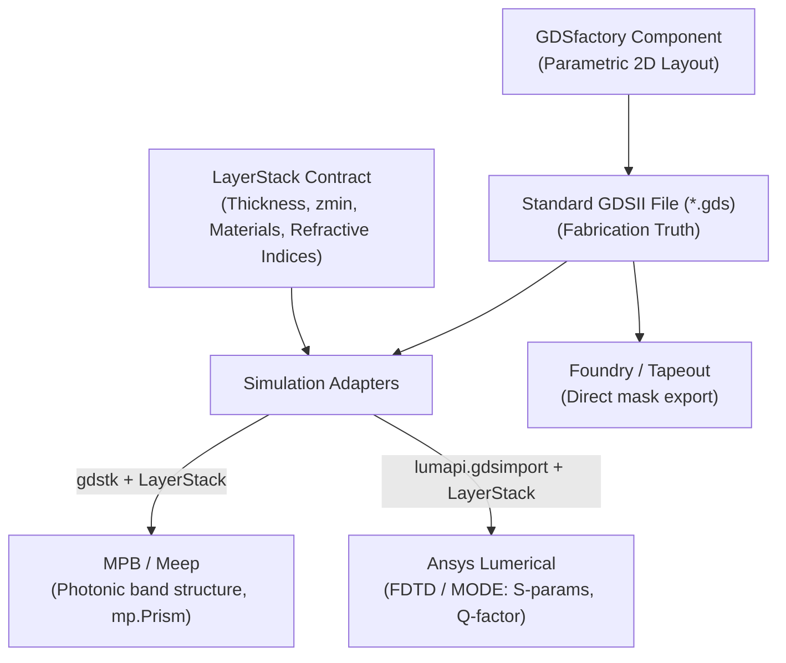

# Single Source of Truth (SSOT) Architecture for Photonic Geometries & Simulation

This document establishes the architecture, conventions, and implementation guidelines for defining photonic crystal and integrated photonics geometries in this workspace.

---

## 1. Core Principle: "Define Once, Simulate Everywhere"

A major challenge in photonics simulation is discrepancies between fabrication masks (GDSII) and numerical solver models (MPB, Lumerical, Meep, COMSOL).

**The SSOT Rule**:
All physical geometry must be defined once as a **2D planar layout** (`gdsfactory.Component` $\to$ `.gds` file) combined with a **3D technology contract** (`gdsfactory.technology.LayerStack`). Solvers never redefine shapes independently; they consume the GDS layout and the `LayerStack`.



---

## 2. The Two Pillars of SSOT

### Pillar 1: 2D Planar Layout (GDSII)
- **Tool**: `gdsfactory` (`packages/phc_layout/src/phc_layout/components/`).
- **Format**: `.gds` binary file on disk (or in-memory `gdsfactory.Component` containing polygons).
- **Responsibility**: Defines the exact 2D boundary polygons, lattice placements, holes, waveguides, and cavity boundaries.
- **Layers**: Standard integer `(layer, datatype)` pairs defined in `phc_layout.tech.LAYER_PHC`:
  - `LAYER_PHC.ETCH = (1, 0)`: Etched regions / holes.
  - `LAYER_PHC.SLAB = (2, 0)`: Slab background boundary / core waveguide.

### Pillar 2: 3D Technology Contract (`LayerStack`)
- **Tool**: `gdsfactory.technology.LayerStack` (`packages/phc_layout/src/phc_layout/tech.py`).
- **Responsibility**: Provides the vertical ($z$) dimensions, materials, mesh priorities, and etch profiles that GDS files lack.

#### Multi-Project & Multilayer Support
Different projects require different material platforms (SOI, LNOI, $Si_3N_4$, III-V membranes) or complex multilayer stacks (partial etch, clad, substrate, electrodes). 

We handle this by making the `LayerStack` **swappable and configuration-driven**:

1. **Declarative YAML Stacks (`configs/stack/`)**:
   Projects define their stack in YAML. Hydra dynamically loads the desired stack:
   ```yaml
   # configs/stack/soi_220nm.yaml
   name: soi_220nm
   background_material: air
   layers:
     substrate:
       layer: [0, 0]
       thickness: 2.0
       zmin: -2.0
       material: sio2
     slab:
       layer: [2, 0]        # LAYER_PHC.SLAB
       thickness: 0.22      # 220 nm
       zmin: 0.0
       material: si
       mesh_order: 2
     etch:
       layer: [1, 0]        # LAYER_PHC.ETCH
       thickness: 0.22
       zmin: 0.0
       material: air
       mesh_order: 1        # Higher priority replaces slab in solvers
   ```

2. **Multilayer & Partial-Etch Stacks**:
   A stack can define multiple vertical levels (e.g. rib waveguide with shallow etch vs full etch, or suspended membrane). Solvers iterate generically over all defined layers:
   ```python
   # Example: Suspended Membrane or Partial-Etch Ridge
   layers = {
       "slab_full": LayerLevel(
           layer=(1, 0), thickness=0.22, zmin=0.0, material="si", mesh_order=2
       ),
       "partial_etch": LayerLevel(
           layer=(3, 0), thickness=0.07, zmin=0.15, material="air", mesh_order=1
       ),
       "substrate": LayerLevel(
           layer=(0, 0), thickness=2.0, zmin=-2.0, material="sio2", mesh_order=3
       ),
   }
   ```

3. **Centralized Material Registry & Anisotropy**:
   Materials are mapped between solver representations via a shared registry. Full specifications, anisotropic models, and database handling are maintained in [`MATERIALS.md`](file:///home/enrva/phc/MATERIALS.md).
   - **MPB / Meep**: Scalar index or diagonal tensor via `mp.Medium(epsilon_diag=...)`.
   - **Lumerical**: Managed via **Method A (Version-Controlled `.mdf` File)**. All custom and anisotropic materials reside in `materials/*.mdf` within the repository and are imported via `fdtd.importmaterialdb(...)` upon solver initialization. Manual machine-local GUI defaults are strictly avoided to ensure HPC/CI reproducibility.


---

## 3. Solver Adapters Specification

### A. MPB / Meep Adapter (`gdstk` $\to$ `mp.Prism`)
Full physics formulation, coordinate transformation API, polarization selection, and solver usage are detailed in [`MPB.md`](file:///home/enrva/phc/MPB.md).
- **Source**: Directly reads the `.gds` file via `gdstk` (official Meep-recommended standard) or extracts polygons from `gdsfactory.Component`.
- **Extrusion**: Cross-references each polygon's layer with the `LayerStack`:
  - $z$-span: $z_{\min} \dots z_{\min} + \text{thickness}$ (or infinite for 2D calculations).
  - Material: assigns `mp.Medium(index=n)`.
- **Simulation Setup & Coordinate Transformations**:
  - The simulation domain uses `geometry_lattice = mp.Lattice(...)`:
    - `basis1, basis2, basis3`: Unit lattice directions (e.g. $(1, 0, 0)$ and $(0.5, \sqrt{3}/2, 0)$).
    - `size`: Domain size in units of basis vectors (e.g. `size=mp.Vector3(1, 1, 0)` for primitive cell, or `size=mp.Vector3(1, N, 0)` for an $N$-row supercell).
    - `basis_size`: Physical lengths of basis vectors (defaults to unit lengths).
  - Built-in MPB transformation utilities to utilize:
    - `mpb.cartesian_to_lattice(vec, lat)`: Maps GDS Cartesian coordinates $(x/a, y/a)$ into fractional lattice coordinates $(c_1, c_2)$. Used to verify if polygons fall within unit cell bounds $[-0.5, 0.5]$.
    - `mpb.lattice_to_cartesian(vec, lat)`: Maps fractional lattice coordinates back to Cartesian space.
    - `mpb.cartesian_to_reciprocal(k_vec, lat)`: Converts Cartesian $k$-vectors (units of $2\pi/a$) into the reciprocal lattice basis for `k_points`.
    - `mpb.geometric_objects_lattice_duplicates(lat, objects, [ux, uy, uz])`: Automatically replicates a primitive cell geometry into a larger supercell.
  - Polygons become a list of `mp.Prism(vertices=..., height=..., center=..., material=...)`.

### B. Lumerical Adapter (`lumapi.gdsimport`)
- **Source**: Passes the `.gds` file path directly to Lumerical's Python API:
  ```python
  import lumapi

  fdtd = lumapi.FDTD()

  for name, layer_level in layer_stack.layers.items():
      fdtd.gdsimport(
          gds_path,
          cell_name,
          layer_level.layer[0],  # GDS Layer number
          layer_level.material,  # Database material string
          layer_level.zmin * 1e-6,  # zmin in meters
          (layer_level.zmin + layer_level.thickness) * 1e-6,  # zmax in meters
      )
  ```
- **Guaranteed Consistency**: Both Lumerical and MPB simulate identical polygon coordinates derived from the same source file.

---

## 4. Directory & Module Conventions

```text
phc/
├── SSOT.md                                    # Core architecture & simulation contract
├── MATERIALS.md                               # Material databases & anisotropy memory
├── MPB.md                                     # MPB solver & coordinate systems memory
├── materials/                                 # Global materials (materials.yaml, custom_materials.mdf)
├── packages/
│   ├── phc_layout/                            # Pure GDS layout generation (gdsfactory)
│   │   ├── src/phc_layout/tech.py             # LayerMap & LayerStack definitions
│   │   └── src/phc_layout/components/         # Unit cells, supercells, cavities
│   ├── phc_materials/                         # Material registry, anisotropy, .mdf tools
│   │   └── src/phc_materials/                 # Models, MPB & Lumerical translators
│   ├── phc_mpb/                               # MPB solver adapter & band analysis
│   │   └── src/phc_mpb/                       # GDS -> MPB ModeSolver, lattice, plotting
│   └── phc_lumerical/                         # (TODO) Lumerical FDTD/MODE runner & gdsimport
├── examples/
│   └── demo_hex_2d_mpb.py                     # End-to-end demonstration script
└── configs/                                   # Hydra presets (geometry, simulation, stack)
```


---

## 5. Development Checklist for New Features

- [ ] **Never hardcode geometry in solver scripts**: Geometry must come from `gdsfactory` or an exported `.gds` file.
- [ ] **Always define vertical properties in `tech.py` (`LayerStack`)**: Never scatter slab thicknesses or refractive indices across solver scripts.
- [ ] **Verify GDS integrity**: Ensure layouts pass DRC / geometry checks before sending to solvers.
- [ ] **Decoupled execution**: Exported `.gds` files must remain standalone so they can be opened in KLayout or run through external solvers independently.
